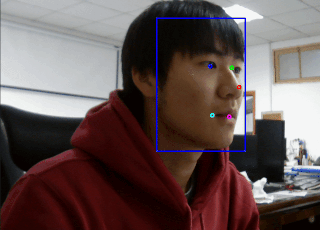

# Some interesting code

# Environment

`requirements.txt` ∈ `python 3.7.4`  

# Usage

| Command                                 | Illustration              | Description                                                                    |
| --------------------------------------- | ------------------------- | ------------------------------------------------------------------------------ |
| `python retinaface_camera/infer_gpu.py` |  | &emsp;I used tensorflow to reproduce the [retinaface](https://github.com/deepinsight/insightface/tree/master/RetinaFace) and trained for a period of time.   &emsp;The implementation summary blog is [here](https://zhen8838.github.io/2019/12/19/retinaface/) |
| `python pfld_camera/infer_pfld.py` |  | &emsp;I used tensorflow to reproduce the [pfld](https://github.com/guoqiangqi/PFLD) and trained for a period of time.   &emsp;The implementation summary blog is [here](https://zhen8838.github.io/2019/12/21/pfld/) |
| `python yolov3_camera/infer_yolov3.py` |  | &emsp;I used tensorflow to reproduce the [yolov3](https://pjreddie.com/darknet/yolo/) and trained for a period of time.   &emsp;The implementation summary blog is [here](https://zhen8838.github.io/2019/07/10/yolo-error/)   &emsp; demo model is mobilenetv1-yolov3 (30mb 69.7map@voc)|
