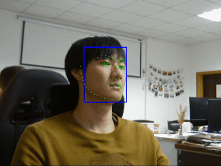
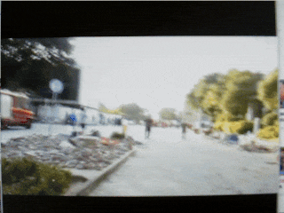
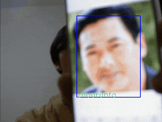
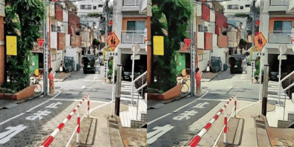
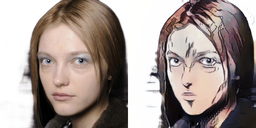

# Some interesting code

# Environment

`requirements.txt` ∈ `python 3.7.4`  

# Usage

<table>
<thead>
<tr>
<th>Command</th>
<th>Illustration</th>
<th>Description</th>
</tr>
</thead>
<tbody>
<tr>
<td colspan=2 > 
  
 </td>
<td> A Small Magnetic suspension System   open source in <a href="https://github.com/cczu-osa/magnetic-suspension">here</a> </td>
</tr>
<tr>
<td><code>python retinaface_camera/infer_gpu.py</code></td>
<td></td>
<td> I used tensorflow to reproduce the <a href="https://github.com/deepinsight/insightface/tree/master/RetinaFace">retinaface</a> and trained for a period of time.    The implementation summary blog is <a href="https://zhen8838.github.io/2019/12/19/retinaface/">here</a></td>
</tr>
<tr>
<td><code>python pfld_camera/infer_pfld.py</code></td>
<td></td>
<td> I used tensorflow to reproduce the <a href="https://github.com/guoqiangqi/PFLD">pfld</a> and trained for a period of time.    The implementation summary blog is <a href="https://zhen8838.github.io/2019/12/21/pfld/">here</a></td>
</tr>
<tr>
<td><code>python yolov3_camera/infer_yolov3.py</code></td>
<td></td>
<td> I used tensorflow to reproduce the <a href="https://pjreddie.com/darknet/yolo/">yolov3</a> and trained for a period of time.    The implementation summary blog is <a href="https://zhen8838.github.io/2019/07/10/yolo-error/">here</a>     demo model is mobilenetv1-yolov3 (30mb 69.7map@voc)</td>
</tr>
<tr>
<td><code>./facerec_camera/make_database.sh</code>   <code>python facerec_camera/infer_facerec.py</code></td>
<td></td>
<td> I used tensorflow to reproduce the <a href="https://github.com/deepinsight/insightface">insightface</a> and trained for a period of time.     demo model is mobilenetv1-0.25 (99.8@lfw)</td>
</tr>
<tr>
<td colspan=2 > </td>
<td> I used tensorflow to reproduce the <a href="https://github.com/TachibanaYoshino/AnimeGAN">AnimeGAN</a> and trained for a period of time.     open source in <a href="https://github.com/zhen8838/AnimeGAN">here</a></td>
</tr>
<tr>
<td colspan=2 ></td>
<td> I use <a href="https://github.com/minivision-ai/photo2cartoon">U-GAT-IT</a> to training a model which can convert photo to JOJO style cartoon.  This model is currently not working well, please <a href="https://zhen8838.github.io/2020/06/08/U-GAT-IT/">refer here</a> for details </td>
</tr>
<tr>
<td colspan=2 ></td>
<td> I wrote a series of <a href="https://github.com/zhen8838/Statistical-Learning-Method">code demos</a> for the book <strong>统计学习方法 第二版(李航)</strong>
</tr>
</tbody>
</table>